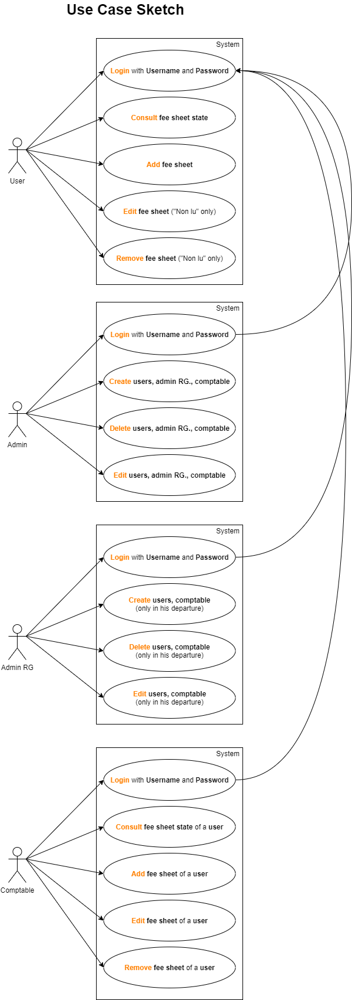

# DOSSIER TECHNIQUE EPREUVE E5

Lien du projet https://gsb.best/

## Sommaire

1. Introduction
   1. L’enjeu
   2. La problématique
   3. Origine du projet
   4. L’énoncé général du besoin
   5. Contraintes
   6. Diagramme des exigences
   7. La carte mentale des besoins du client
   8. Le diagramme de cas d’utilisation
   9. Le croquis (dessin)
   10. Analyse de l’existant
   11. Distribution des tâches
   12. Choix des outils de gestion de projet
2. Développement
   1. Base de donnée
3. Conclusion
   1. Résumé des problèmes rencontrés
   2. Coûts prévisionnels de production
   3. Bilan personnel
4. Annexes
   1. ...

## 1. Introduction

#### 1. L’enjeu

Le suivi des frais est actuellement géré de plusieurs façons selon le laboratoire d'origine des utilisateurs. On souhaite uniformiser cette gestion.

L'application doit permettre d'enregistrer tout frais engagé, aussi bien pour l'activité directe (déplacement, restauration et hébergement) que pour les activités annexes (événementiel, conférences, autres), et de présenter un suivi daté des opérations menées par le service comptable (réception des pièces, validation de la demande de remboursement, mise en paiement, remboursement effectué).

#### 2. La problématique

Crée une application de gestion de frais érgonomique et sécurisé, accèsible via applicaiton mobile ainsi que web mobile/ordinateur tout en respectant le chahier des charges établis

#### 3. Origine du projet

Il s'agit de la continuiter du projet GSB application de gesion de frais

#### 4. L’énoncé général du besoin

L'application GSB.best est un produit qui a pour objectif de simplifié la gestion de frais. Cette application est disponible au format web mobile/ordinateur ainsi que sur une application mobile. Il y a plusieur fontionalité tel que la gestion d'utilisateurs, la gestion de frais standardiser ainsi que la gestion de fiche de frais. Cette application embarque également une couche de sécurité lié à l'API. L'application est faite pour étre utiliser toute l'année. Il doit y avoir le moin de maintenance pour l'application.

#### 5. Contraintes

L'application Web destinée aux utilisateurs, délégués et responsables de secteur sera en ligne, accessible depuis un ordinateur et un smartphone. La partie utilisée par les services comptables sera aussi sous forme d'une interface Web.
Une application mobile devra également être créée dans le but de pouvoir recevoir des notifications. En plus des fonctionnalités citées ci dessus.

##### 1) ​Architecture

Une entente à était trouvé entre le client et le prestataire sur base de schéma (Organigramme / Diagramme de flux).
Il y aura plusieurs rôle dans l’application :

- Administrateur
- Administrateur région
- Comptable
- Utilisateur

##### 2) ​Ergonomie

Les pages fournies ont été définies à la suite d'une consultation. Elles constituent une référence ergonomique. Des améliorations ou variations peuvent être proposées.

##### 3) ​Codage

Le document “ApplisWeb-NormesDevelpt” présente des règles de bonnes pratiques de développement utilisées par le service informatique de GSB pour encadrer le développement d’applications en PHP et en faciliter la maintenance.

##### 4) ​Environnement

Le prestataire sera dans l’obligation d’utiliser un framework et devra justifier le choix de celui-ci avec un tableau. Les langages seront également à l'appréciation du prestataire.

##### 5) ​Modules

L'application présente trois modules : (Database et interface graphique)
enregistrement des opérations et suivi par les utilisateurs
enregistrement des opérations par les comptables
enregistrement d’utilisateurs par les administrateurs

##### 6) ​Documentation

La documentation devra présenter l'arborescence des pages pour chaque module, le descriptif des éléments, classes et bibliothèques utilisées, la liste des frameworks ou bibliothèques externes utilisés.

##### 7) ​Responsabilités

Le commanditaire fournira à la demande toute information sur le contexte nécessaire à la production de l'application.
Le commanditaire fournira une documentation et des sources exploitables pour la phase de test : base de données exemple, modélisation,...
Le prestataire est à l'initiative de toute proposition technique complémentaire.
Le prestataire fournira un système opérationnel, une documentation technique permettant un transfert de compétence et un mode opératoire propre à chaque module.

#### 6. Diagramme des exigences

XXXXX

#### 7. La carte mentale des besoins du client

XXXXX

#### 8. Le diagramme de cas d’utilisation

#### 9. Le croquis (dessin)

XXXXX

#### 10. Analyse de l’existant

XXXXX

#### 11. Distribution des tâches

Pour la disctribution et l'organisation des taches nous avons utiliser le site Trello.
Disponible ici :

https://gsb.best/?t

#### 12. Choix des outils de gestion de projet

## 2. Développement

## 3. Conclusion

#### 1. Résumé des problèmes rencontrés

#### 2. Coûts prévisionnels de production

#### 3. Bilan personnel

## 4. Annexes